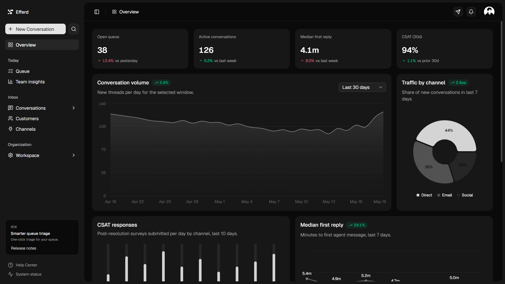

# 💼 Staffly — Workforce & Support Operations Dashboard

Staffly is an all-in-one workforce management and support operations platform that helps businesses monitor employees, attendance, leave, payroll, recruitment, performance, and HR operations efficiently through a secure cloud-based system. It is designed to save time, improve productivity, and simplify human resource management for modern organizations. 💼✨

This Next.js application provides a state-of-the-art interactive support dashboard featuring real-time performance tracking, queue analytics, team availability, and satisfaction metrics.



---

## 🚀 Key Features

- **⚡ Real-time Queue Triage**: Monitor open queue depth, active conversations, and live support requests.
- **📊 Analytics & Performance Insights**:
  - **Conversation Volume**: Track conversation volume trends over time.
  - **First Reply Time**: Analyze response latency to maintain high service levels.
  - **CSAT Trends**: Monitor Customer Satisfaction (CSAT) ratings over rolling 30-day periods.
  - **Channel Breakdown**: Visualize incoming traffic across chat, email, phone, and other integrations.
- **👥 Team Management (On-Duty)**: Track active operators, check their on-duty status, and manage active workloads.
- **💬 Recent Conversations & Activity**: View recent active/resolved threads, assignment statuses, and general activity logs.
- **🛠️ Responsive Modern Sidebar**: Collapsible navigation with categorized folders (Queue, Insights, Conversations, Customers, Channels, and Settings) matching premium modern web aesthetics.

---

## 🛠️ Tech Stack

Staffly is built using the following modern web technologies:

- **Framework**: [Next.js 15+](https://nextjs.org/) (App Router, React 19)
- **Styling**: [Tailwind CSS v4](https://tailwindcss.com/)
- **Components**: [Radix UI](https://www.radix-ui.com/) & [shadcn/ui](https://ui.shadcn.com/)
- **Charts**: [Recharts](https://recharts.org/)
- **Icons**: [Lucide React](https://lucide.dev/)
- **Language**: [TypeScript](https://www.typescriptlang.org/)

---

## 📂 Project Structure

```text
staffly/
├── src/
│   ├── app/                  # Next.js App Router (Layouts, Global Styles)
│   ├── components/           # UI and Feature Components (Charts, Stats, Sidebar)
│   │   ├── ui/               # Reusable Radix UI & Shadcn components
│   │   ├── app-sidebar.tsx   # Premium Navigation Sidebar
│   │   ├── dashboard.tsx     # Main Dashboard grid layout
│   │   └── *-chart.tsx       # Recharts visualization modules
│   ├── hooks/                # Custom React Hooks
│   └── lib/                  # Utility functions & helpers
├── public/                   # Static assets (images, icons)
├── package.json              # Project dependencies and script runner configurations
└── tsconfig.json             # TypeScript configuration
```

---

## ⚙️ Getting Started

### 1. Clone the repository and navigate to the directory
```bash
git clone https://github.com/lakshithamadumal/Staffly.git
cd Staffly
```

### 2. Install dependencies
```bash
npm install
```

### 3. Run the development server
```bash
npm run dev
```
Open [http://localhost:3000](http://localhost:3000) with your browser to see the live application.

### 4. Build for production
```bash
npm run build
npm run start
```

---

## 🎨 Design System & Aesthetics

Staffly follows a strict dark-mode-first aesthetic (built on rich colors like `#0d0d0f` and `zinc-900`) combined with modern UI practices:
- **Glassmorphism**: Translucent card backgrounds and borders.
- **Clean Typography**: Premium font weights and sizes using modern sans-serif layouts.
- **Micro-interactions**: Interactive states, transitions, and hover-triggered icons for smooth navigation.
